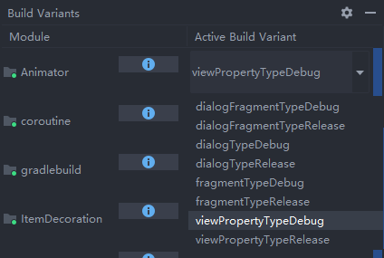
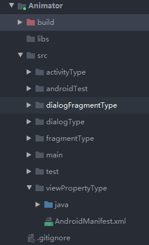

为方便调试，在build.gradle中创建了多个构建变体，如下：



其中，单独为viewPropertyType这个flavor设置是sourceSets，如下：

```groovy
sourceSets {
    viewPropertyType {
        java.srcDirs = ['src/viewPropertyType/java']
        manifest.srcFile 'src/viewPropertyType/AndroidManifest.xml'
    }
}
```

主要就是为了能在调试属性动画时，能直接一步到位，不需要点击就能直接抵达指定页面，所以只要在运行指定变体类型时，使用指定清单文件，这样就会直接跳转到指定页面



创建变体和设置sourceSets后，就开始创建指定目录和清单文件，清单文件内容如下：

```xml
<?xml version="1.0" encoding="utf-8"?>
<manifest xmlns:android="http://schemas.android.com/apk/res/android"
    package="com.zzq.animator">

    <application
        android:allowBackup="true"
        android:icon="@mipmap/ic_launcher"
        android:label="@string/app_name"
        android:roundIcon="@mipmap/ic_launcher_round"
        android:supportsRtl="true"
        android:theme="@style/AppTheme">
        <activity
            android:name=".activity.ViewPropertyActivity"
            android:label="@string/title_activity_view_property" >
            <intent-filter>
                <action android:name="android.intent.action.MAIN" />

                <category android:name="android.intent.category.LAUNCHER" />
            </intent-filter>
        </activity>
        <activity android:name=".MainActivity">

        </activity>
    </application>

</manifest>
```

所以，在运行前，最好是选择合适的构建变体后再运行，可避免不需要的页面出现